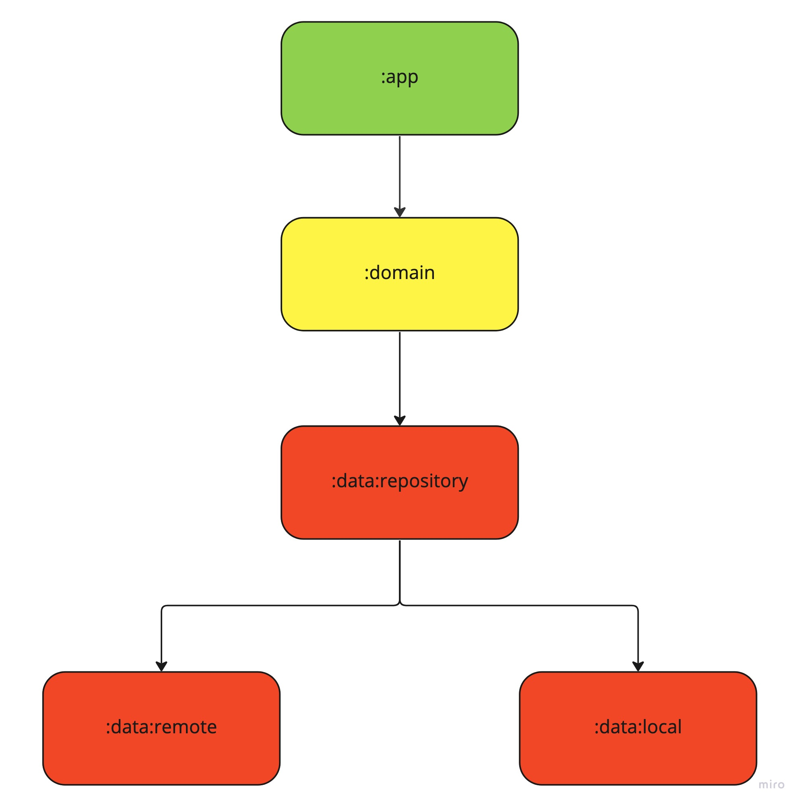

# Coins

#### Architecture

This repository is based on the Clean-MVI architecture pattern, which combines the Clean Architecture principles with the Model-View-Intent (MVI) pattern.

#### UI
    

#### Test
1. Unit Test for repository

#### Technologies
Compose, Hilt, Retrofit, Room, Coil, mockk, junit, Coroutine and Flow

